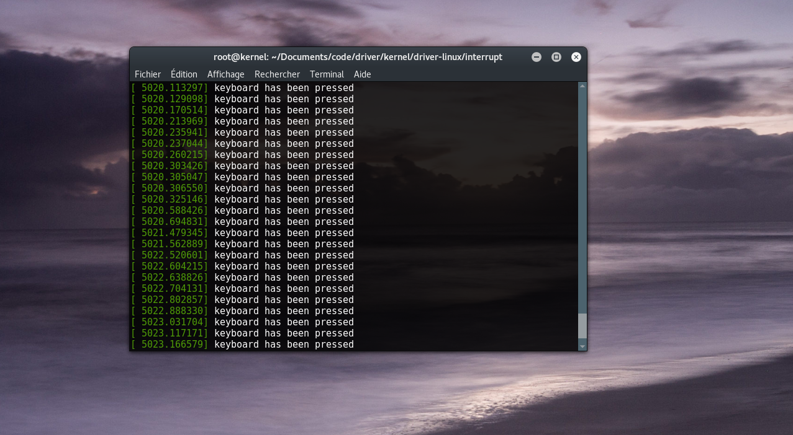

#Interrupt

This is a simple code that show how to create and handle intterupt in the linux kernel

It is a really small one to be really easy to understand

You can now change it to handle all hardware request (keyboard, mouse, homme button on android smartphone ...)
